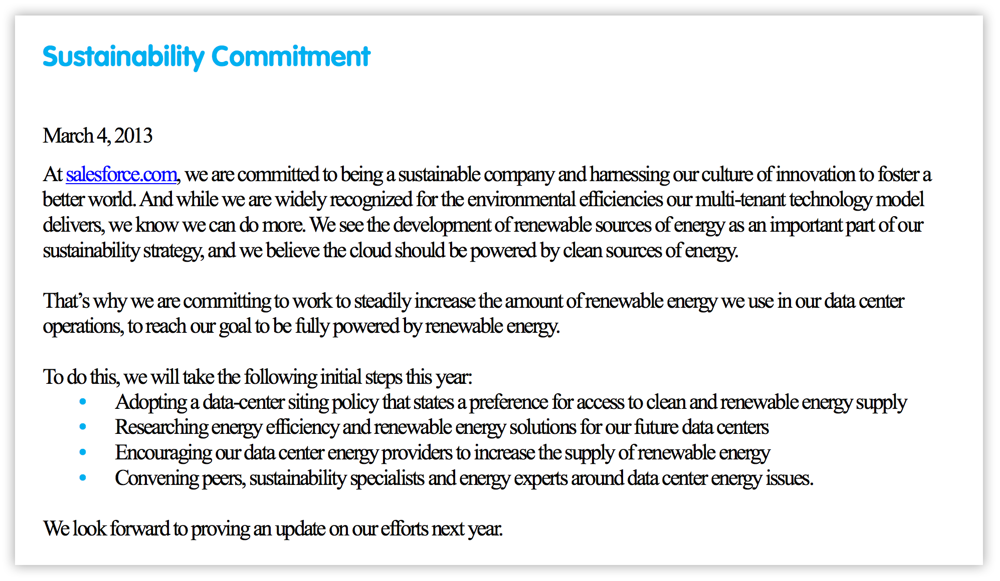

# A Guide for Employees: How To Make Your Tech Company Sustainable

Welcome! This is a fast primer for regular employees on how to make your tech company adopt stronger sustainability practices and positions. Here you’ll find a brief overview of sustainability terms and concepts, and learn about real-word experiences of tech sector employees who set up enduring, ambitious sustainability programs at their companies.

Bringing sustainability to your company can seem like an uphill task. There are many potential hurdles — conflicting company priorities, gaining leadership buy-in, confusion over the size of the company’s carbon footprint, and so on. However, it *can* be done. More than that, it *has* been done (many times), and therefore you can do it too.

The people who wrote this guide have been involved in these efforts in different tech companies, large and small. Outside of ourselves, we have conducted original research looking at employees of other tech companies who have been involved in similar efforts. The knowledge presented here in this guide based on these real stories of employees who were responsible for creating and progressing real sustainability programs, both at lesser-known and at household-name tech firms.

We wrote this guide to help you achieve success too.

# Begin with a sustainability statement

In our research we were surprised to discover a clear pattern for success. When employees wrote and submitted detailed proposals for sustainability programs, they tended to get stuck in the mire. However, when employees started with a much simpler gesture — drafting and asking for agreement on a simple, public sustainability statement — it often turned out to be the first step in a longer, progressive success story.

In these scenarios, not only was the publication attempt more likely to succeed, but new carbon reduction initiatives were soon to follow. We therefore recommend that you first prepare and build support for a public sustainability commitment, and dig into the implementation of program specifics later.

# What is a sustainability statement?

All companies who are serious about their carbon footprint have some form of public sustainability commitment, with periodic measurement and reporting on how they are doing. This is similar in nature to how some companies report their financial health, or their employee diversity statistics. A regular public release of information shows that the company has a position, and wants to publicly hold itself accountable on taking measurable steps toward its goals.

A sustainability statement can actually be very simple. Take a look at Salesforce’s sustainability statement, first [published](https://www.salesforce.com/assets/pdf/misc/Sustainability_Commitment.pdf) in March of 2013:

The statement is short, general and aspirational, which is what makes it easier to get agreement on and to publish — there’s simply not much detail for stakeholders within the company to object to.

Once the statement is made however, the conversation moves from *whether* to do something, to exactly *what should be done* and *how quickly*. This puts stakeholders within the company in a position where they have an agreed general statement of purpose, setting the stage for achievement without treading on toes or binding hands.

We can see this in action over the subsequent years at Salesforce. In 2015, the company had begun signing major new agreements with a new wind farm to power their data center operations. By 2017, Salesforce declared that their datacenter operations were now at [net zero carbon emissions](https://www.salesforce.com/blog/2017/04/salesforce-net-zero-greenhouse-gas.html).

The exact form and scope of your company’s statement can be varied. However if your company is new to the business of sustainability, it’s probably best to start fairly simple, like Salesforce, and to increase in complexity over time as you gain experience.

# Where to publish your statement

Having crafted your statement, there are many options for where to publish it. At the lightest end of the scale, some companies have been known to simply [post on facebook](https://www.facebook.com/green/posts/236221773113928) or a [static document](http://s21.q4cdn.com/374309911/files/doc_downloads/corporate_governance/Intuit_Sustainability_Policy_Final_Nov11.pdf). Other companies [issue a standard press release](https://www.workday.com/en-us/company/newsroom/press-releases/press-release-details.html?id=2051222), and it is common [to publish to a ](https://www.switch.com/sustainability/)[page on the company’s website](https://www.switch.com/sustainability/).

If your company is ready, they can perhaps go further by taking their statement to a renewable energy industry group. For example, [the RE100](http://there100.org/re100) is a collaborative, global initiative of influential businesses committed to 100% renewable electricity, working to massively increase demand for, and delivery of, renewable energy. Tech companies from Adobe and Apple to Salesforce and VMware have already joined.

Groups like this will help your company socialize and spread its sustainability message, and find partners and like-minded organizations to collaborate with and learn from. However this is merely an option for some, and we’d suggest getting the simple statement agreed upon and published before anything else.

# All roads lead to measurement

Once your statement is published, the natural next question is about how to achieve your your company’s aims, as described in the statement. However, before you can begin on an implementation towards your aims, you have to think about a more pressing question. How will you measure how far you are from those aims now, and how much progress you have made towards them over time?

In other words, how will your company know how much sustainability impact they are having? Your company will need to adopt a system of measurement, and it is useful to do this early, so that you are not flying blind at the start.

The first step will be to measure the company’s carbon footprint. However before you run off and start adding up numbers, you will have to do a little reading. There are specific rules for what is known as *carbon accounting* — the practice of measuring amounts of carbon dioxide equivalents emitted by an entity, whether that is a nation state, a corporation or an individual.

Let’s look at an example. Imagine your company sells widgets on Amazon, which are delivered by the delivery company UPS. When someone buys one of your widgets, is the carbon used to deliver it counted as burned by your company, by Amazon, by UPS or by the end consumer? Intuitively it’s hard to say, though a "common sense" point of view would likely tell you that all parties are implicated to varying degrees.

# Following a common protocol

To answer difficult questions like these, a standard known as the [Greenhouse Gas Protocol](http://www.ghgprotocol.org/about-us) has been widely adopted. This protocol [contains rules](http://www.icomplisustainability.com/index.php/ask-the-expert/ghg-management/item/63-what-are-the-differences-between-scope-1-2-and-3-greenhouse-gas-emissions/63-what-are-the-differences-between-scope-1-2-and-3-greenhouse-gas-emissions) for categorizing emissions from various sources, so that carbon is not double-counted, under-counted and doesn’t go uncounted at all.

Some organizations do a [comprehensive carbon accounting](http://globalimpact.workday.com/sustainability-in-the-cloud/index.html) bringing in internal or external experts who will report to one of the detailed standards. Other companies do a [less formally rigorous analysis](https://medium.com/netflix-techblog/netflix-streaming-more-energy-efficient-than-breathing-57658d47b9fd), focusing on likely key areas: data centers, buildings, employee travel and factory direct energy use.

Either way, determining a measurement process that makes sense for your business allows you to have objective standards by which to measure yourself is an important step to serious change. Our recommendation is that rather than getting caught up with the precise details, for your first pass you simply set out to estimate the most emissions-intensive components of your business.

The Environmental Defense Fund runs a Climate Fellows program to pair sustainability-focused graduate students with companies who want a short engagement with outside expertise. For example, an EDF fellow [helped Akamai develop](http://edfclimatecorps.org/engagement/akamai-technologies-2014) a more accurate estimate of their server energy usage and carbon footprint, and found software improvements that alone could save over $250,000 a year in energy and resource costs. If your company is wants an outside expert to help with the climate accounting you need to do, you too can [host a climate fellow](http://edfclimatecorps.org/hosts) for 10-12 weeks.

# How do you measure up?

A quick way to estimate what your company’s carbon footprint might be is to find a peer who has a similar business model. At most "cloud based" technology companies the majority of the carbon footprint comes from data center energy use. At other companies it might be from fabrication and manufacturing processes, company travel or directly from other company business interests. Here are a few examples.

"Cloud Heavy" Companies

* Facebook: [72% datacenter, 9% travel, 5% offices](https://sustainability.fb.com/our-footprint/)

* Workday: [53% datacenter, 14% offices, 3% travel](http://globalimpact.workday.com/sustainability-in-the-cloud/index.html#important)

* Salesforce: [50% datacenter, 32% travel, 10% offices](https://www2.sfdcstatic.com/assets/pdf/misc/salesforce-stakeholder-impact-report-fy15-fy16.pdf)

Manufacturing Companies

* Apple: [72% manufacturing, 17% product usage, 4% product transportation](https://images.apple.com/environment/pdf/Apple_Environmental_Responsibility_Report_2017.pdf) 

* Fairphone: [82% manufacturing, 13% product usage, 7% product transport](https://www.fairphone.com/wp-content/uploads/2016/11/Fairphone_2_LCA_Final_20161122.pdf)

Consulting Companies

* Accenture: [47% air travel, 32% electricity, 20% other business travel](https://www.accenture.com/us-en/company-environment)

Knowing where the bulk of your carbon pollution comes from will help you achieve the greatest gains by directing your efforts appropriately.

# From measurement to implementation

Once you have gained and published your company consensus around sustainability aims, and you have some hard numbers to work from, what next? It’s time to start making the actual change! 

This can be an area where many of us feel out of our natural element. Committing an organization to a change is a sizable task, and depending on your position within the company, you may feel that you aren’t positioned well to direct these types of efforts.

The good news is, you shouldn’t have to direct this by yourself. You and other colleagues may be passionate advocates, but an important part of building consensus around a statement is that the company must now find or appoint some form of leadership to the tasks. Your role here will most likely be to make sure it doesn’t drop to the back burner — your advocacy got your company this far, and your advocacy will help it get much further.

There are no hard and fast rules about how you will take on this part of the challenge. A lot will depend on your specific circumstance and the circumstance of the company itself. However, here are some general truisms that we have discovered along our journeys, which we hope will help you too.

# 1. Make everybody win

Those of us who have truly read and digested the reality of the situation on climate change might think that the preservation of a habitable planet for our children would be argument enough.

However, if you think about it, the scope of that argument is massive, and the change you are trying to accomplish is modest by comparison. Your one company can’t solve the climate crisis on its own, even with the most ambitious methods. Your company has to play its part alongside other companies, governments, and individuals the world over.

The people you are trying to convince to adopt change, like the department heads and decision-makers already know all of this, and they have their various business operations for which they are primarily responsible day to day. Your surest route to success is going to be when you can tap into those drives and desires, which are much more visceral in people’s minds. Change is easiest to bring about when everybody perceives it as being in their interest.

That doesn’t mean that you have to portray sustainable practice as being the key driver for each department of your company! It very likely isn’t. But you can make the case that the changes won’t significantly impact the department, or even better, that there is some positive effect.

Imagine you are trying to get some department to cut down on its air travel, or for the company to buy offsets to compensate. What might be the effect on employee retention? Will employees take more pride in the company? Will that make them more likely on average to stay and be loyal to the company? How will that impact recruitment?

Which departments, other than recruiting, might you most likely find allies within? What about marketing or public relations, who are always looking for ways to show your company in a good light?

Most carbon reduction is tied to better resource utilization — fewer servers, fewer employee travel-miles, etc — that save the company money directly. Look for the people whose budget would be improved by reducing carbon expenditures and work with them toward both carbon and cost-reduction ends. A good place to start would be the accounting department, who are looking at these numbers every day.

In other words, look for the win-wins, and use them to sweeten deals.

# 2. Don’t fly solo

Working on your own can be hard. Even if you are able to sustain that long enough to really get things started, you are going to struggle in the medium and long term unless you are working with others. 

Working with others helps ease the load in so many ways. Perhaps a friend, or a newly formed internal committee can help you set goals and brainstorm approaches. It may be a long climb to the top of the mountain, but the work you are doing here is so important, and others will be delighted to share that with you. If you don’t know who is going to work with you yet, keep looking. There are advocates everywhere waiting to be found.

# 3. Gain strength from an outside community

This one is the same, but looking outside the company as well as inside. There are many people out there who have been where you are now and who are doing what you are trying to do.

The authors of this guide are a group called ClimateAction.Tech, and we created this group to help and support people like you. In fact, we very likely *are* people like you, so join our slack community and chat to us about where you are at and how you are getting on.

There are also plenty of industry conferences, like [Companies vs Climate Change](http://www.solveclimatechange.com/) which are full of individuals trying to make change in the world. You could attend, or maybe even pitch a talk on the industry impacts you've learned about for an upcoming tech conference.

If you work in Silicon Valley, Seattle, New York, or Las Vegas there's a good chance you can meet someone who's already done this work, and if you're anywhere else there's a good chance you can meet people who care about it. Check out your local Meetup.com groups, or do a little searching on the internet.

Finding others with similar climate concerns is often just a matter of bringing up the subject, and people will appreciate that you've actually got some ideas and possible solutions in mind.

# Good luck

What you are doing here is so important, and we hope you feel charged and ready to embark on your mission. We’ve said it before during this guide, and we will say it again — it can be done, and you are not the only one who wants to do it!

You’ll find a ready community with us at ClimateAction.Tech, so please <a href="mailto:hello@climateaction.tech?subject=Tech Sustainability Guide">contact us</a> and join our slack. Good luck, and we are looking forward to helping you and seeing you achieve success!

